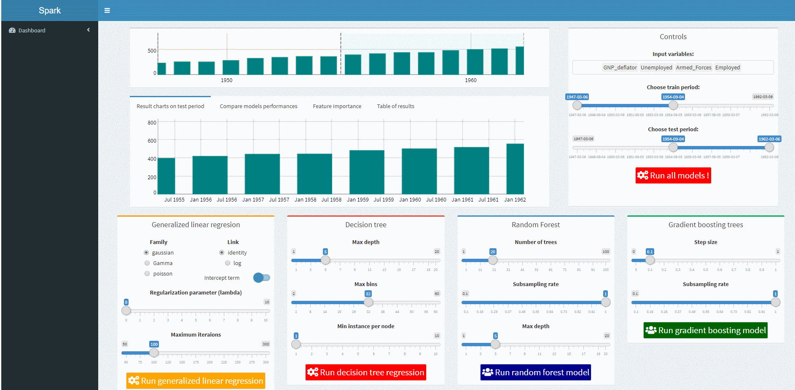

<!-- README.md is generated from README.Rmd. Please edit that file -->

```{r setup, include=FALSE}
knitr::opts_chunk$set(echo = TRUE)
library(manipulateWidget)
```

[](https://travis-ci.org/JeanBertinR/shinyML)

# dashR

Implement in one line of code a shareable web app to compare supervised machine learning regression models! 

With dashR, you can compare your favorite regression models issued from H2O or Spark frameworks without any effort. 


## Installation


You can install the released version of dashR from [CRAN](https://CRAN.R-project.org) with:

```{r eval=FALSE}
install.packages("shinyML")
```

You can also install the latest development version from github:

```{r eval=FALSE}
devtools::install_github("JeanBertinR/shinyML", ref="develop")
```

## Getting started

This is a basic example which shows you how to run the app:

```{r example, eval=FALSE, message=FALSE, out.width=600, out.height=400}

library(shinyML)
longley2 <- longley %>% mutate(Year = as.Date(as.character(Year),format = "%Y"))
shiny_h2o(data =longley2,x = c("GNP_deflator","Unemployed" ,"Armed_Forces","Employed"),y = "GNP",date_column = "Year",share_app = TRUE,port = 3951)
```





For more information take a look at the [package vignette](https://cran.r-project.org/web/packages/manipulateWidget/vignettes/manipulateWidgets.html).


