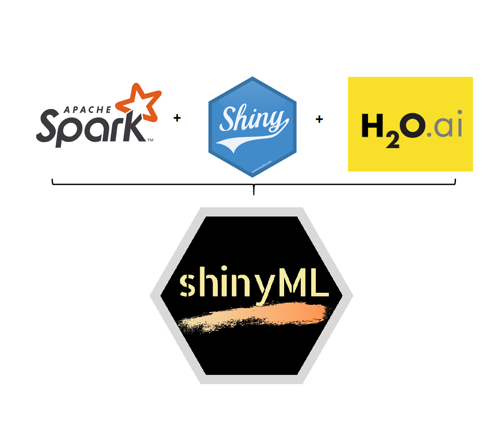
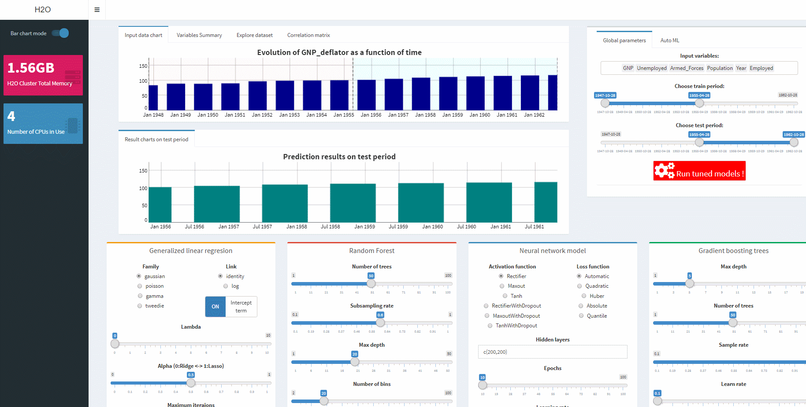
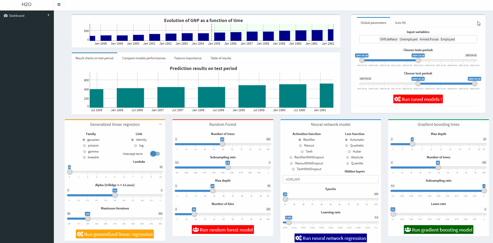
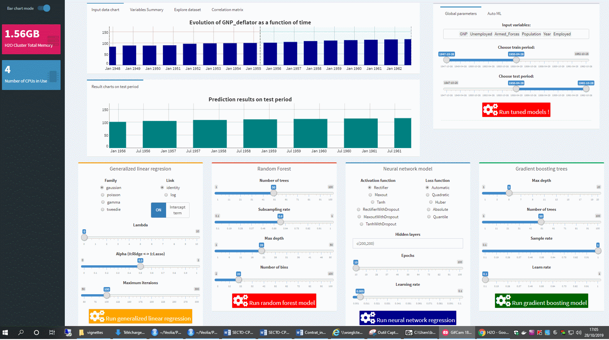
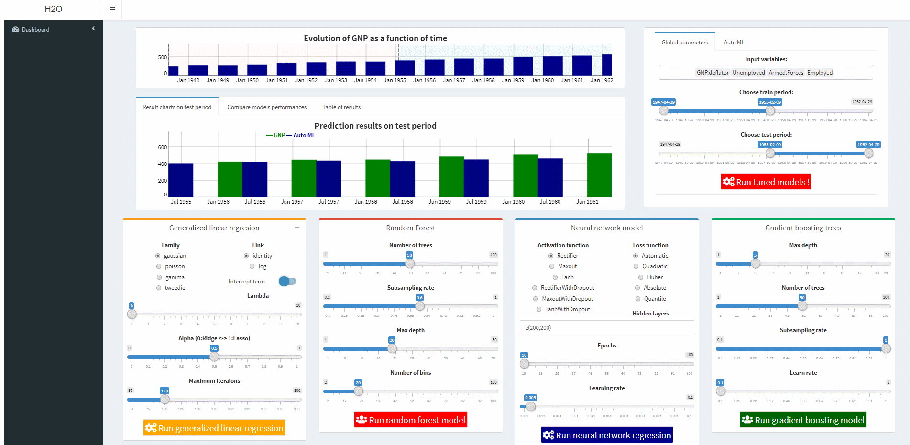

```{r setup, include=FALSE}
knitr::opts_chunk$set(echo = TRUE)
library(shinyML)
```


## Description

  `shinyML` is a Shiny application that helps you to easily compare supervised machine learning regression models. The two main functions of this package are `shinyML_regression` and `shinyML_classification` which leaves the choice for the user to train and test models on H2O or Spark framework. 
  
  
<center>

</center>


  Once you get your data stored on a data.table or data.frame object, you can just use one line of code to run `shinyML_regression` or `shinyML_classification` functions in order to automatically deploy an interactive shiny app.  This app can be shared your colleagues if you put `share_app` argument to `TRUE` and select a port that is free on your server. 

```{r example, eval=FALSE, message=FALSE, out.width=600, out.height=400}

library(shinyML)

# An example of regression task 
shinyML_regression(data = iris,y = "Petal.Width",framework = "h2o")

# An example of classification task  
shinyML_classification(data = iris,y = "Species",framework = "h2o")
```

### Explore input dataset before running the models...
  Before running machine learning models, it can be useful to inspect the distribution of each variable and to have an insight of dependencies between explanatory variables. Both`shinyML_regression` and `shinyML_classification` functions allows to check classes of explanatory variables, plot histograms of each distribution and show correlation matrix between all variables. This tabs can be used to determine if some variable are strongly correlated to another and eventually removed from the training phase.You can also plot variation of every variable as a function of another using the "Explore dataset" tab. 

<center>

</center>


## Running the app...

  Once the shiny app has been launched, you can manually adjust main parameters of regression or classification supervised models (such as generalized linear regression, Logistic regression, Naive Bayes, Random forest, Neural Network, Gradient Boosting ...) by moving the corresponding cursors. 
In addition to hyper-parameters setting for each model, you can adjust train and test period and choose which explanatory variables you want to keep during the training phase. 


<center>

</center>


  You can then run each model separately or run all models simultaneously clicking the corresponding button to each box.  
  
  
<center>

</center>

  You will see a validation message box once all models have been trained: at that point, you can have an overview of your results comparing variables importances and error metrics like MAPE  or RMSE.


## Run autoML algorithm to find automatically configure the best machine learning regression model associated to your dataset 


  AutoML algorithm will automatically find the best algorithm to suit your regression or classification task: as soon as the maximum time for searching will be reached, you'll get a message box indicating which machine learning model has been chosen to suit your task and specifying all corresponding hyper-parameter values.   

  The only settings that must be adjusted by the user are the value of searching time and the model families authorized during the training phase. Please notice that this functionality is for the moment only available using H2O framework. 

<center>

</center>


